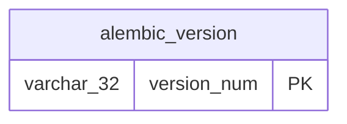

# Schema 0001 — Persistence foundation

Alembic revision: `0001`; parent: none. No domain tables yet.

```mermaid
erDiagram
    alembic_version {
        varchar_32 version_num PK
    }
```

The next milestone adds authenticated user and team identity tables.
